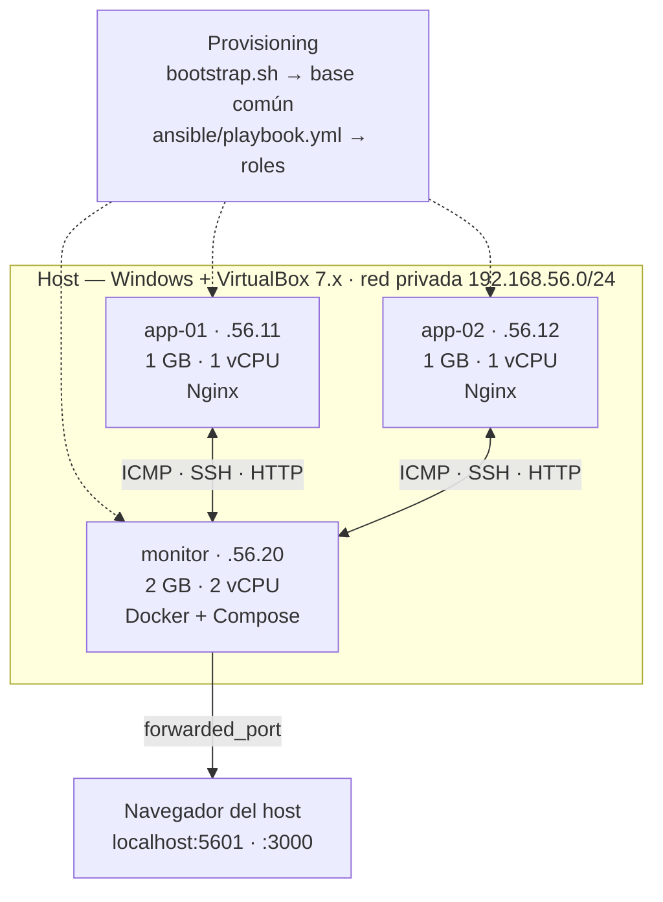

# Vagrant Lab — Entorno de virtualización reproducible

Laboratorio multi-VM definido por código para practicar administración de Linux,
troubleshooting y escenarios de falla **sin tocar producción y sin miedo a romper nada**.

> Parte de mi ruta de especialización en SRE / DevOps.
> Contexto: vengo de gestión de incidentes críticos (P1/P2) en Fintech y Telco,
> y construyo estos entornos para practicar del lado de la prevención.

---

## El problema

En operaciones, la pregunta "¿qué pasa si este servicio se cae?" casi nunca se puede
responder probando. Producción no se toca, y armar un entorno de pruebas a mano
—instalar el SO, configurar la red, dejar las herramientas listas— toma horas y
termina siendo distinto cada vez que lo rehacés.

Sin un entorno descartable no hay forma de practicar la respuesta a incidentes.

## La solución

Infraestructura declarada en un `Vagrantfile`: tres nodos Ubuntu 22.04 en red privada,
con dos capas de provisioning —un `bootstrap.sh` mínimo y un playbook de Ansible
opcional—. El entorno completo se levanta con un comando, se destruye con otro, y
**siempre queda idéntico** porque está definido en código versionado.



---

## Requisitos

- [VirtualBox](https://www.virtualbox.org/) 7.x
- [Vagrant](https://www.vagrantup.com/) 2.4+
- ~4 GB de RAM libres y ~10 GB de disco

## Cómo levantarlo

```bash
git clone https://github.com/seamnex/vagrant-lab.git
cd vagrant-lab

vagrant up                  # levanta los 3 nodos (primera vez: ~5-10 min)
vagrant status              # estado de cada VM
vagrant ssh app-01          # entrar a un nodo
vagrant destroy -f          # borrar todo
```

Comandos útiles durante el laboratorio:

```bash
vagrant reload app-01              # reiniciar un nodo
vagrant provision monitor          # re-ejecutar el provisioning
vagrant halt                       # apagar sin destruir
vagrant ssh app-01 -c "uptime"     # ejecutar un comando remoto
```

---

## Aprovisionamiento

Hay dos capas, y conviven a propósito.

**`scripts/bootstrap.sh`** corre siempre. Deja el piso mínimo: herramientas de
diagnóstico, zona horaria y resolución de nombres entre nodos. Es Bash, es rápido
y no depende de nada.

**`ansible/playbook.yml`** es opcional y describe el estado final de cada rol:

```bash
ANSIBLE=1 vagrant up              # levanta y aplica el playbook
ANSIBLE=1 vagrant provision       # re-aplicar sin recrear las VMs
```

| Grupo | Nodos | Qué instala | Cómo se verifica |
|---|---|---|---|
| `app` | app-01, app-02 | Nginx + una página que identifica al nodo | `uri` contra `localhost` esperando 200, con reintentos |
| `monitoreo` | monitor | Docker + Compose, `vagrant` en el grupo `docker` | `docker info` |

Corre con el provisioner **`ansible_local`**, es decir *dentro* de cada VM. No es
un detalle menor: Ansible no tiene soporte nativo en Windows, y exigir WSL solo
para levantar el laboratorio rompería la reproducibilidad que es el punto de todo
esto. El costo es que Vagrant instala Ansible en cada VM, y por eso va detrás de
una variable de entorno en vez de estar siempre activo.

Si tenés una máquina de control Linux/WSL/macOS con acceso SSH a las VMs, el
`ansible/inventory.ini` sirve para correrlo desde afuera:

```bash
vagrant ssh-config > /tmp/ssh-lab
ansible-playbook -i ansible/inventory.ini ansible/playbook.yml
```

### Por qué agregar Ansible si el Bash ya funcionaba

El `bootstrap.sh` funciona, pero **no es idempotente**: su bloque de `/etc/hosts`
usa `cat >>`, así que cada `vagrant provision` duplica las tres líneas. Nunca lo
noté porque en el flujo normal se corre una sola vez —y esa es exactamente la
clase de bug que aparece el día que reprovisionás un nodo en medio de un incidente.

La tarea equivalente en el playbook usa `lineinfile` con un `regexp`: corrés diez
veces, queda una línea. **La diferencia entre un script y una herramienta de
gestión de configuración no es el lenguaje: es que una describe pasos y la otra
describe el estado final**, y solo la segunda es segura de re-ejecutar sobre un
nodo cuyo estado no conocés. Que es, siempre, el nodo del incidente.

Detalle chico con el que me tropecé: el grupo de Ansible se llama `monitoreo` y
no `monitor` porque el host ya se llama así, y un grupo homónimo hace que Ansible
avise `Found both group and host with same name` y vuelve ambiguo el `hosts:`.

---

## Escenarios de falla para practicar

El valor del laboratorio no es levantarlo: es **romperlo a propósito** y medir cómo
te enterás y cuánto tardás en diagnosticarlo.

| # | Escenario | Cómo provocarlo | Qué observar |
|---|---|---|---|
| 1 | Nodo caído | `vagrant halt app-02` | ¿Cuánto tarda en detectarse desde `monitor`? |
| 2 | Disco lleno | `fallocate -l 8G /tmp/relleno` | Alertas de umbral, servicios que dejan de escribir |
| 3 | Saturación de CPU | `stress-ng --cpu 4 --timeout 300` | Load average, latencia de respuesta |
| 4 | Pérdida de red | `sudo ip link set eth1 down` | Timeouts vs. errores de conexión |
| 5 | Servicio muerto | `sudo systemctl stop <servicio>` | Diferencia entre "caído" y "no responde" |

Para cada escenario, el ejercicio real es cronometrar:
**tiempo hasta detectarlo (MTTD)** y **tiempo hasta diagnosticar la causa**.

---

## Bitácora de pruebas

<!-- COMPLETAR: llená esta tabla con tus corridas reales.
     No la publiques con datos inventados: el valor de esta sección
     es que sea evidencia verdadera de que corriste el laboratorio. -->

| Fecha | Escenario | MTTD | Cómo lo diagnostiqué | Aprendizaje |
|---|---|---|---|---|
| | | | | |

## Qué me llevo de este lab

<!-- COMPLETAR después de correrlo. Ideas para desarrollar:
     - Qué diferencia hay entre un nodo "caído" y uno "degradado"
       desde el punto de vista de quien monitorea.
     - Qué señal te habría avisado antes de que el servicio se cayera.
     - Qué parte del diagnóstico fue manual y podría automatizarse. -->

---

## Estructura

```
vagrant-lab/
├── Vagrantfile            # definición de los 3 nodos + provisioners
├── scripts/
│   └── bootstrap.sh       # provisioning base (herramientas, hosts, timezone)
├── ansible/
│   ├── playbook.yml       # estado final por rol: Nginx en app, Docker en monitor
│   └── inventory.ini      # inventario para correrlo desde una máquina de control
└── README.md
```

## Licencia

MIT
